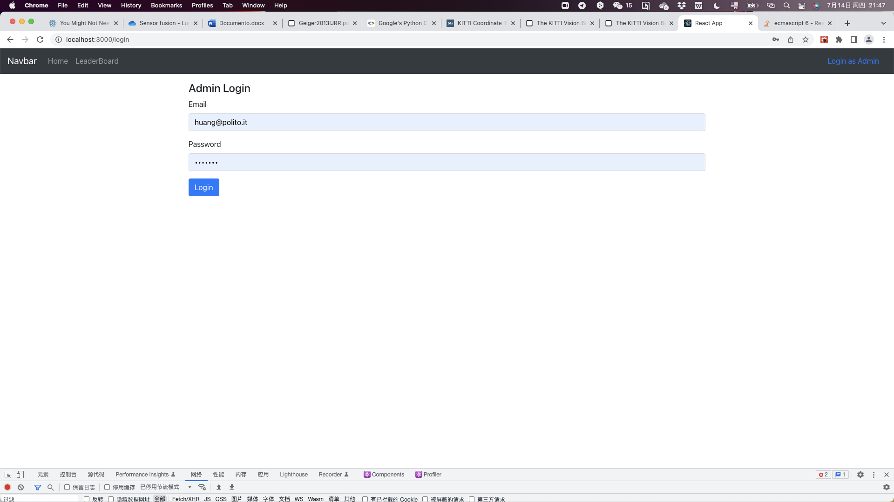
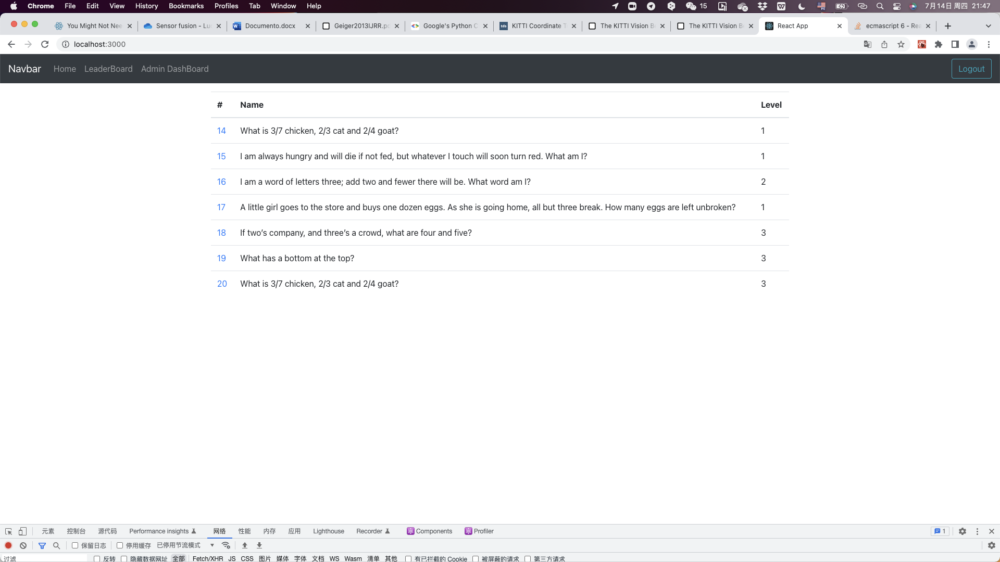

# Exam #2: "SolveMyRiddle"
## Student: s272486 CAO PENG 

## React Client Application Routes

- Route `/`: Home page, user can see all the riddles in this page.
- Route `/survey/:id`: 'id' identify which one riddle you are seeing now. In this page you can fill this survey.
- Route `/login`:Login page, admin can use email and password to login to admin page.
- Route `/admin`:Admin page, in this page admin can see all the riddles which he created and how many people answer for each riddle.
- Route `/admin/survey`:Admin can creat survey in this page.
- Route `/admin/answers/:id`:'id' identify which one survey you are seeing now. Admin can check the anwsers of this riddle.

## API Server

- POST `/api/session`
  - Description: Login send eamil and password.
  - request parameters and request body content: 
  {
    "username": "admin@polito",
    "password": " student ",
  }

  - response body content:
  {
    "id": "1",
    "name": " Admin ",
    "username": admin@polito.it
  }

- GET `/api/surveys/me`
  - Description: Get the riddles which created by the certain admin and each num_of_users.
  - request parameters: _None_
  - response body content: An array of objects, each describing a riddles.
  [
    {
        "id": 3,
        "name": "Test",
        "num_of_users": 2,
        "questions": [
            {
                "type": 0,
                "title": "1",
                "optional": false,
                "options": [
                    "1",
                    "2"
                ],
                "min": 0,
                "max": 1
            }
        ],
        "created_at": "2022-07-14 13:37"
    }
]

- GET `/api/surveys`
  - Description: Get all the riddles.
  - request parameters: _None_
  - response body content: An array of objects, each describing a riddles.
  [
    {
        "id": 14,
        "name": "What is 3/7 chicken, 2/3 cat and 2/4 goat",
        correctanswer: "chicago"
        created_at: "2022-07-12 22:27"
        duration: 30
        hintone: "america "
        hinttwo: "city"
        id: 14
        level: "1"
        name: "What is 3/7 chicken, 2/3 cat and 2/4 goat?"
        openstate: 2
        "questions": [
            {
            {type: 1,
             title: "What is 3/7 chicken, 2/3 cat and 2/4 goat?", 
             optional: false}]

            title: "What is 3/7 chicken, 2/3 cat and 2/4 goat?"
            type: 1
            timer: 30   
    },
    ...
]
  
- GET `/api/surveys/${id}`
  - Description: Get the certain id survey 
  - request body content:_None_
  - response body content:describing a certain riddles.
  {
        0: {id: 14, name: "What is 3/7 chicken, 2/3 cat and 2/4 goat?",…}
        correctanswer: "chicago"
        created_at: "2022-07-12 22:27"
        duration: 30
        hintone: "america "
        hinttwo: "city"
        id: 14
        level: "1"
        name: "What is 3/7 chicken, 2/3 cat and 2/4 goat?"
        openstate: 2
        questions: 
        [{type: 1, title: "What is 3/7 chicken, 2/3 cat and 2/4 goat?", optional: false}]
        timer: 30
        }
- GET `/api/answers/${id}`
  - Description: Get the answers for a certain survey.
  - request body content:_None_
  - response body content:An array of objects, each describing an answer.
  [
    {
        correctanswer: "chicago"
        created_at: "2022-07-12 22:27"
        duration: 30
        hintone: "america "
        hinttwo: "city"
        id: 14
        level: "1"
        name: "What is 3/7 chicken, 2/3 cat and 2/4 goat?"
        openstate: 2
        questions: [{type: 1, title: "What is 3/7 chicken, 2/3 cat and 2/4 goat?", optional: false}]
        timer: 30
        user_id: 2
    },

]
- POST `/api/answers`
  - Description: post the answers the user filled.
  - request parameters and request body content: 
  {
    result: [{title: "What is 3/7 chicken, 2/3 cat and 2/4 goat?", texts: ["chi?"]}]
    0: {title: "What is 3/7 chicken, 2/3 cat and 2/4 goat?", texts: ["chi?"]}
    score: 0
    survey_id: 14
    username: "huanghaihang"
  }
  - response body content:{}

- DELETE `/api/sessions/current`
  - Description: Logout
  - request parameters and request body content: _None_
  - response body content: _None_

## Database Tables

- Table `user` - contains email password name
- Table `answers` - servey_id result username score created_at
- Table `surveys` - user_id name questions level duration timer correctanswer hintone hinttwo openstate created_at

## Main React Components

- `Home` (in `HomeComponent.js`): Create a home page, use a table list all the riddles. 
- `PublicSurvey` (in `SurveyComponent.js`): creat a page for fill riddle, a Modal use to fill name, and handle the input and submit to save answer.
- `Questions` (in `SurveyComponent.js`): Form all the riddles, it is a component in PublicSurvey.
- `CreateSurvey` (in `CreateSurvey.js`): For admin creat Riddle, it can choose add riddle  with level title hintone and something else
- `Answers` (in `AnswersComponent.js`): For admin to check all the answers for a riddle. Use Carousel to show all the riddle with two Backword/Forword button.

## Screenshot

## Users Credentials
- username:caopeng@polito.it, password:student 
- username:huang@polito.it, password:student 
- username:admin@polito.it, password:student 
- username:test@polito.it, password:student  
- username:longlong@polito.it, password:student 
